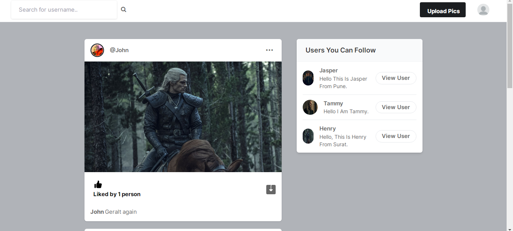
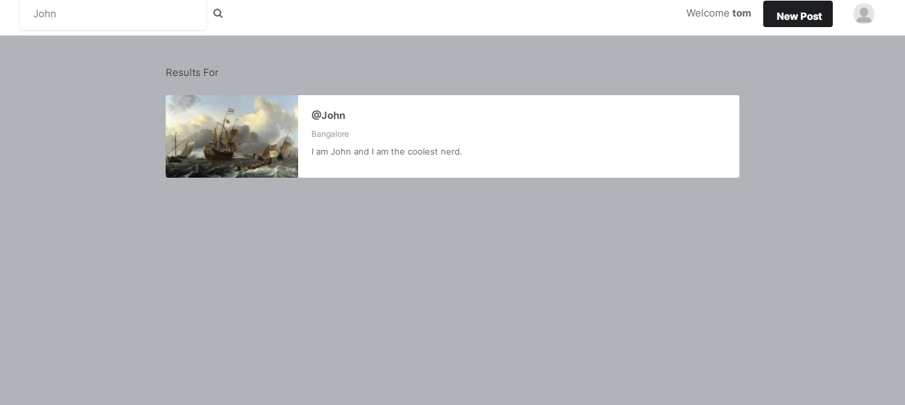
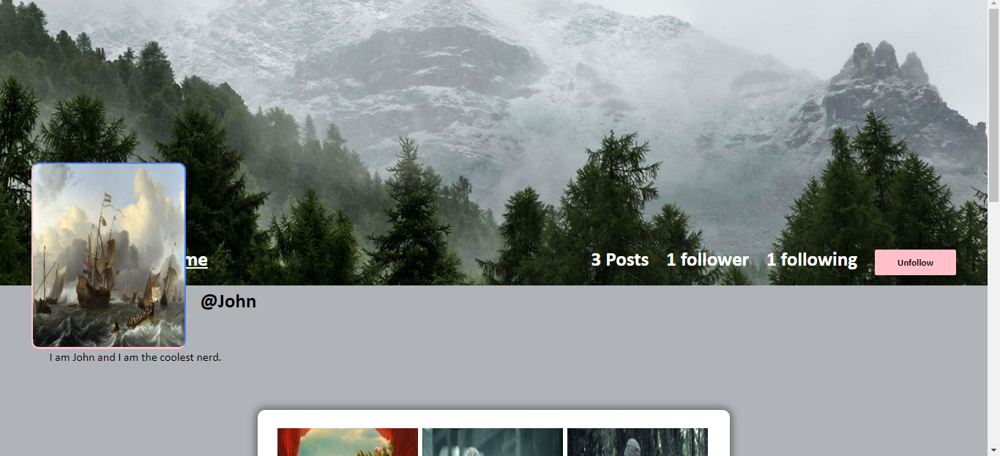
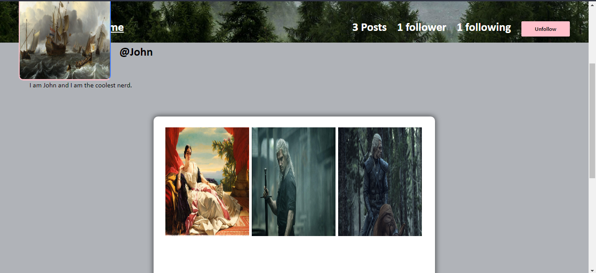
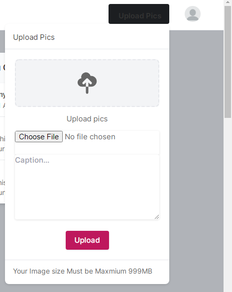
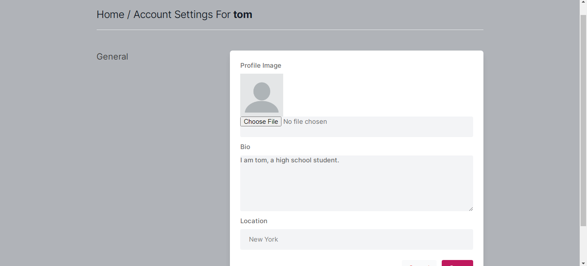

# SocialBook -Social Media App
> Social media app with django, python, html, css, js

## Table of Contents
* [General Info](#general-information)
* [Technologies Used](#technologies-used)
* [Features](#features)
* [Screenshots](#screenshots)
* [Usage](#usage)
* [Project Status](#project-status)
* [Acknowledgements](#acknowledgements)

## General Information
- SocialBook is built using django framework.  
- I undertook this project to learn django framework.

## Technologies Used
- Python 3.8.6
- Django 4.0.4
- HTML5
- BOOTSTRAP
- JavaScript

## Features
- Signup
- Signin
- Logout
- Add profile picture, bio, and location to profile
- Uploading Post to site
- Post feed to see posts from profiles we follow
- Feature to like/unlike a post
- Profile Page where we can see Follower count, and Following count,
- Follow button, Profile settings button, Home button, and Posts uploaded by a particular user 
- Feature to download images
- Feature to search users
- User suggestions in post feed

## Screenshots

## Usage

`python manage.py runserver`

## Project Status
Project is: _Complete_

## Acknowledgements
- This project was based on [this tutorial](https://youtu.be/xSUm6iMtREA).
- Many thanks to FreeCodeCamp YouTube channel and instructor CodeWithTomi.
